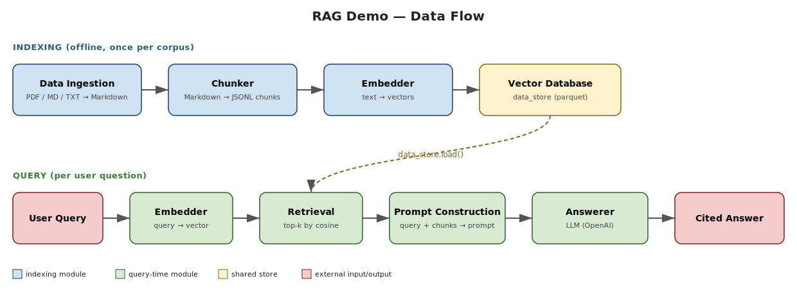

# rag-demo

A minimal, modular Retrieval-Augmented Generation pipeline. Each stage is a standalone package that reads from one folder under `data/` and writes to the next, so any block can be run, swapped, or upgraded in isolation.

## Architecture



Two pipelines share the same data store: **indexing** runs offline (once per corpus); **query** runs per user question.

## Stages

| # | Module | Input | Output |
|---|--------|-------|--------|
| 1 | `document_processing` | `data/raw/` (PDF / MD / TXT) | `data/markdown/` (`.md` with YAML frontmatter) |
| 2 | `chunker` | `data/markdown/` | `data/chunks/` (`.jsonl`, one chunk per line) |
| 3 | `embedder` | `data/chunks/` | `data/embeddings/` (parquet via `ParquetStore`) |
| 4 | `retriever` | a `data_store` + a query string | in-memory `list[RetrievalResult]` |
| 5 | `answerer` | a query string + retrieved chunks | `Answer` (cited LLM response) |

## Quick start

```bash
pip install -r requirements.txt jupyter
jupyter notebook notebooks/01_demo.ipynb
```

Drop a PDF (or `.md` / `.txt`) into `data/raw/` before running the notebook. For the OpenAI-backed embedder and answerer, create a `.env` at the repo root with `OPENAI_API_KEY=sk-...` (gitignored).

## Eval

A small ground-truth dataset lives at `eval/questions.json` (10 questions over the demo PDF — multi-choice and one-word, each with a verbatim excerpt for validation). Run the suite after the indexing pipeline has populated `data/embeddings/`:

```bash
python eval/run_eval.py
```

Reports two scores: **retrieval accuracy** (does any top-k chunk contain the ground-truth excerpt?) and **answer accuracy** (does the LLM's response contain the expected answer string?), broken down per question type.

## Swappable backends

- **Embedder:** `LocalEmbedder` (`sentence-transformers/all-MiniLM-L6-v2`, no API key) or `ApiEmbedder` (OpenAI `text-embedding-3-small`).
- **Data store:** `ParquetStore` (current default). Add new classes — FAISS, Chroma, etc. — to `embedder/data_stores.py` exposing `add(embeddings, source_stem)` and `load()`; the rest of the pipeline doesn't change.
- **Answerer prompt:** the `prompt=` argument to `answer()` is a `.format`-style template with `{query}` and `{chunks}` placeholders — swap framing without touching the answerer code.
